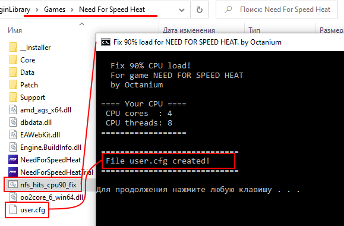

# NFS Heat CPU Load FIX
 Need for Speed Heat, CPU 90-100% load fix (script, windows)

 ## Instruction

 - copy **nfs_hits_cpu90_fix.cmd** ([download page (link)](https://github.com/Octanium91/NFS_Heat_CPU_Load_FIX/releases)) in *Need for Speed Heat* main folder
 - run **nfs_hits_cpu90_fix.cmd** *(script create user.cfg for your CPU)*
 - start game, be heppy :)

 *that’s about to work out...*
  
 
